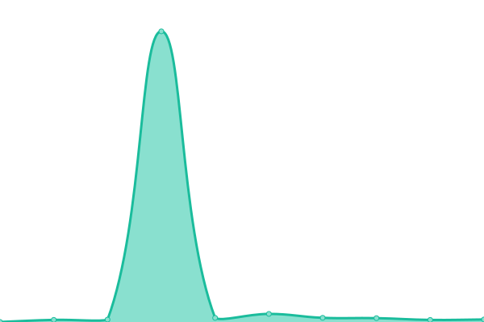
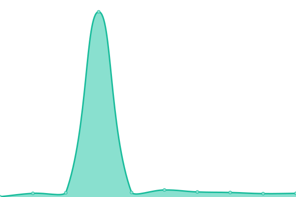

# [📈 Live Status](https://bloxtechgroup.github.io/status): <!--live status--> **🟩 All systems operational**

This repository contains the open-source uptime monitor and status page for [BloxTech Group](https://bloxtech.tech), powered by [Upptime](https://github.com/upptime/upptime).

With [Upptime](https://upptime.js.org), you can get your own unlimited and free uptime monitor and status page, powered entirely by a GitHub repository. We use [Issues](https://github.com/bloxtechgroup/status/issues) as incident reports, [Actions](https://github.com/bloxtechgroup/status/actions) as uptime monitors, and [Pages](https://bloxtechgroup.github.io/status) for the status page.

<!--start: status pages-->
<!-- This summary is generated by Upptime (https://github.com/upptime/upptime) -->
<!-- Do not edit this manually, your changes will be overwritten -->
<!-- prettier-ignore -->
| URL | Status | History | Response Time | Uptime |
| --- | ------ | ------- | ------------- | ------ |
|  [BloxTech Dashboard](https://bloxtech.tech/admin) | 🟩 Up | [blox-tech-dashboard.yml](https://github.com/BloxTechGroup/status/commits/HEAD/history/blox-tech-dashboard.yml) | 

 571ms
     
 | 

<a href="https://bloxtechgroup.github.io/status/history/blox-tech-dashboard">100.00%</a>
    

|  [BloxTech API (Roblox)](https://bloxtech.tech/apiv2/status.php) | 🟩 Up | [blox-tech-api-roblox.yml](https://github.com/BloxTechGroup/status/commits/HEAD/history/blox-tech-api-roblox.yml) | 

 187ms
     
 | 

<a href="https://bloxtechgroup.github.io/status/history/blox-tech-api-roblox">100.00%</a>
    

|  [RocketApps Dashboard](https://rocketapps.bloxtech.tech) | 🟩 Up | [rocket-apps-dashboard.yml](https://github.com/BloxTechGroup/status/commits/HEAD/history/rocket-apps-dashboard.yml) | 

 1751ms
     
 | 

<a href="https://bloxtechgroup.github.io/status/history/rocket-apps-dashboard">100.00%</a>
    

|  [RocketApps API (Roblox)](https://roblox-rocketapps.bloxtech.tech) | 🟩 Up | [rocket-apps-api-roblox.yml](https://github.com/BloxTechGroup/status/commits/HEAD/history/rocket-apps-api-roblox.yml) | 

 485ms
     
 | 

<a href="https://bloxtechgroup.github.io/status/history/rocket-apps-api-roblox">100.00%</a>
    

<!--end: status pages-->

[**Visit our status website →**](https://bloxtechgroup.github.io/status)

## 📄 License

- Powered by: [Upptime](https://github.com/upptime/upptime)
- Code: [MIT](./LICENSE) © [BloxTech Group](https://bloxtech.tech)
- Data in the `./history` directory: [Open Database License](https://opendatacommons.org/licenses/odbl/1-0/)
